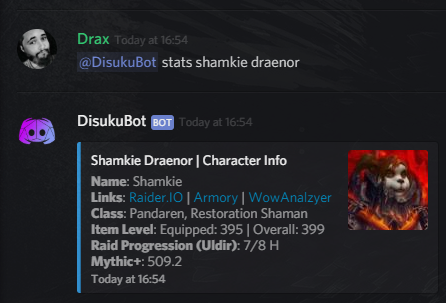
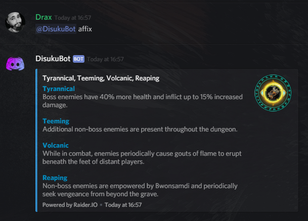

# Raider.IO

## World Of Warcraft Stats

This command gets various basic statistics for your World of Warcraft character. It currently grabs information from the Raider.IO API.

```text
@DisukuBot stats CharacterName ServerName
```


@DisukuBot stats Shamkie Draenor



ServerName defaults to my home server of Draenor EU.




## Raider.IO Weekly Affix Details

This command simply displays the weeks current Mythic+ Affixes.

```text
@DisukuBot Affix
```



